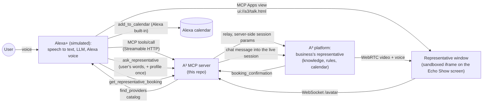

# A³ Live Representative for Alexa+

**Every local business on A³, live on Alexa+, through one MCP server.**

Big brands build their own MCP servers for Alexa+. Millions of local businesses (clinics, salons, studios) never will, so for them Alexa can only read out a list. A³ (Triple A) already lets a business set up its own live video representative: a real-time talking avatar with the business's face and voice, prices, answers, rules and calendar. This project connects A³ to Alexa+ with **one MCP server**, built so that every business on A³ can go live on Alexa without its own integration: a real face on the Echo Show screen, and questions that turn into bookings without leaving Alexa.

> **Demo scope:** the catalog behind `find_providers` is three fictional Austin clinics (`data/providers.json`), each mapped to a representative set up on the A³ platform. Reading the A³ business directory instead of a file is the next step; the tools and views do not change.

- **Live demo (no install):** https://alexa.triplea.studio/sim
- **MCP endpoint (Streamable HTTP, spec 2025-11-25):** `https://alexa.triplea.studio/mcp`
- **Demo video (2:41):** https://youtu.be/ZM8FqtDVUEk

> Alexa+ add-ons are partner-only today, so this repository ships a web simulator of an Echo Show with Alexa+. Every business action in the simulator (search, opening the representative, passing the user's words, reading the booking) is a real MCP tool call to this server, the way an Alexa+ add-on is called; the representative's video and voice then stream over WebRTC. The live conversation window was also tested as an MCP App in Claude and ChatGPT (October 1).

## Try it in 1 minute

1. Open https://alexa.triplea.studio/sim in desktop Chrome.
2. Type (or press the mic button and say): `Alexa, find a place nearby for laser hair removal`.
3. Say `Yes, please`. Hannah, the live representative of a (fictional) Austin clinic, appears on screen and greets you in voice.
4. Ask her anything: `How much is a full leg session? And does it hurt?`, then `Can you book me for Saturday at ten?`. She books you herself; the simulated Alexa passes the name and phone of its signed-in (demo) user, so you are not asked.
5. Say `Thanks, goodbye`, then `Alexa, add it to my calendar`. Alexa fetches the booking over MCP and shows it in the simulator's stand-in for Alexa's calendar.

The green lines in the corner show each MCP tool call and its latency (Alexa's built-in calendar is marked as such; it is not an MCP call).

**Demo limits:** one live conversation at a time (each one uses a real GPU avatar slot), up to 5 minutes. If you see "All representatives are busy", try again in a minute. The three clinics are fictional; no real appointment is created.

## How it works



**Who listens.** On a real Echo Show, third-party web pages in the built-in browser get `NotAllowedError` for the microphone instantly, with no prompt (see the friction log). We could not test an Alexa+ add-on view itself, but we expect the same, and Alexa already listens. So Alexa stays the ears: it recognizes speech and passes the user's words to the representative with `ask_representative`; the representative answers on screen in video and voice. In hosts that grant the microphone (we tested Claude and ChatGPT), the same window talks to the user directly.

**Who books.** The business's representative books, not Alexa: it knows the business's rules, services and calendar. Alexa already knows the signed-in user, so `ask_representative` can carry the user's name and phone once, and the representative never asks for them. In a real deployment this needs the user's consent; the simulator passes a fixed demo profile. Afterwards Alexa reads the confirmed booking with `get_representative_booking` and adds it to its calendar (in the simulator, a stand-in card).

### MCP tools

| Tool | What it does | UI (MCP Apps) |
|---|---|---|
| `find_providers(service, location?)` | Nearby businesses for a service, with prices and whether a live representative is available | `ui://a3/providers.html` |
| `talk_to_representative(provider_id, language?)` | Opens a live video conversation with the business's A³ representative | `ui://a3/talk.html` |
| `ask_representative(provider_id, question, customer?)` | For voice hosts that listen themselves: passes the user's words into the open conversation | — |
| `get_representative_booking(provider_id)` | The appointment the representative confirmed in the last conversation | — |
| `book_appointment(provider_id, service_id, when, customer_name)` | Fallback booking for businesses without a representative (demo, no real appointment) | `ui://a3/booking.html` |

All five tools declare `outputSchema` and return `structuredContent`. Views follow the Alexa+ MCP Apps rules: each is one self-contained HTML document (libraries inlined, no external fonts), rendered in a sandboxed iframe, with its network declared in `_meta.ui.csp` (`connectDomains`, `resourceDomains`) and host communication only through the MCP Apps `postMessage` bridge.

### Code map

| Path | |
|---|---|
| `src/server.ts` | MCP server (tools, MCP Apps resources), WebSocket relay to the A³ platform, demo limits |
| `src/sim.ts` | Alexa+ simulator, server side: LLM turn loop that calls the MCP server over a real MCP client; Alexa voice; Alexa's built-in `add_to_calendar` |
| `sim/client.ts` | Simulator page logic: speech recognition, follow-up mode, MCP Apps host bridge (`AppBridge`) |
| `ui/talk.html` | Representative window: LiveKit WebRTC video and voice, subtitles, microphone where the host allows it |
| `ui/providers.html`, `ui/booking.html` | Result and confirmation views |
| `ui/probe.html` | Diagnostic window: what a host allows inside an MCP Apps view (video, sound, WebSocket, mic, WebRTC, nested frames) |
| `data/providers.json` | Three fictional Austin clinics used in the demo |

## Run it yourself

Requires Node 22+.

```bash
npm ci
cp .env.example .env   # fill in GEMINI_API_KEY; ELEVENLABS_API_KEY is optional
set -a; . ./.env; set +a
npm start              # http://localhost:3401/sim, MCP at http://localhost:3401/mcp
```

The simulator's "Alexa" is played by Gemini Flash with function calling; Alexa's voice is ElevenLabs (falls back to the browser's voice). The live representatives run on the A³ platform, a hosted service: the relay connects to the demo businesses set up there, so no GPU is needed locally.

### Use it as an MCP App in Claude or ChatGPT

Add `https://alexa.triplea.studio/mcp` as a custom connector (Claude: Settings → Connectors; ChatGPT: Developer mode → Create app, no auth). Ask: *"Find a laser hair removal clinic in Austin and let me talk to their representative."*

## What was built for this hackathon

A³ (the avatar platform: real-time talking avatars, per-business setup, knowledge and booking) existed before the hackathon and is used here as a hosted service. Everything in this repository was built from October 1, 2026 for the Alexa+ track:

- the MCP server with five tools and three MCP Apps views, following the Alexa+ add-on layout and CSP rules;
- the representative window as a single self-contained MCP Apps document with WebRTC video;
- the relay that lets a sandboxed view reach the A³ platform: the server, not the view, sets the session parameters and limits;
- **voice-host mode**: Alexa listens and passes words in with `ask_representative`, because Echo Show web pages get no microphone;
- booking by the representative with the assistant's user profile, and the hand-off of the booking back to the assistant's calendar;
- the Echo Show style Alexa+ simulator that calls the MCP server over real MCP;
- demo protection for a public endpoint: one live conversation at a time, time limit, rate limits.

## License

MIT, see [LICENSE](LICENSE). The A³ platform the relay connects to is a separate hosted service and is not covered by this license.
